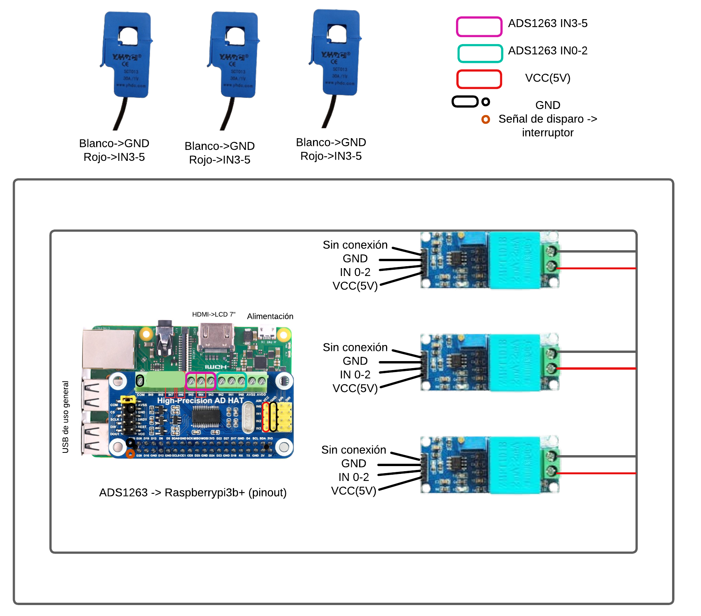
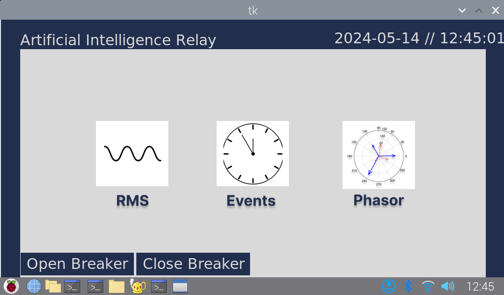
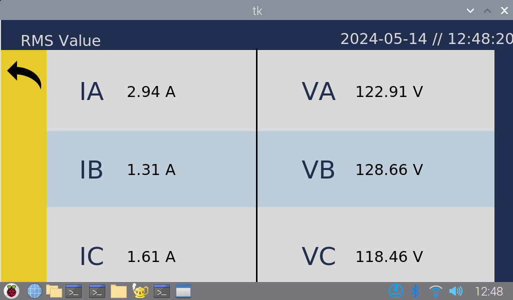
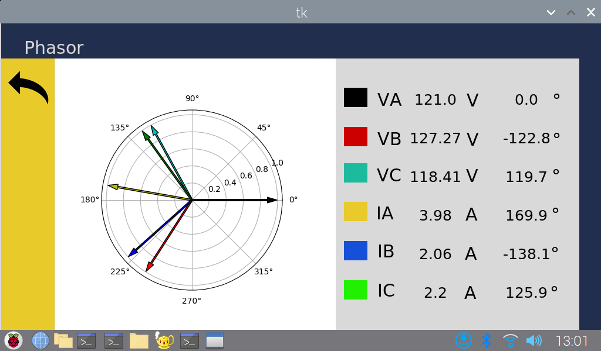
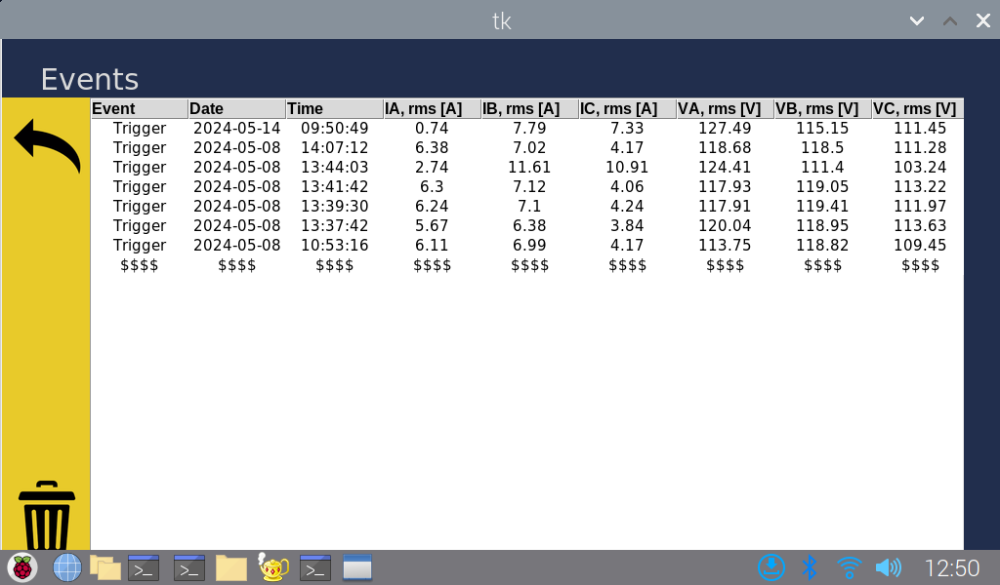

# **Proyecto final "AIR"**: Dispositivo de protección basado en inteligencia artificial
Desarrollado por: Luis Fernando Molina Antequera 

# **Manual de usuario**

#### Arquitectura del dispositivo
Este dispositivo está constituido por los siguientes elementos:
- 3x Sensor ZMPT101B
- 3x Sensor SCT030
- ADC ADS1263 (*waveshare*)
- Raspberry Pi 3B+
- Pantalla LED 7" HDMI

#### Imágenes del dispositivo
### Conexión del dispositivo
Antes de empezar a utilizar el dispositivo, debe realizar y/o revisar la conexión de todos los elementos siguiendo el diagrama mostrado a continuación:

### Primeros pasos
Si es la primera vez que enciende el dispositivo, deberá tener en cuenta las indicaciones del [primer encendido](https://www.raspberrypi.com/documentation/computers/getting-started.html) de una Raspberry Pi 3B+. Una vez haya concluido con esto, deberá habilitar la interfaz de comunicación SPI del dispositivo. Para realizar esta tarea, debe abrir una terminal de comandos ejecutando la combinación de teclas `Ctrl+Alt+T`.

Esto desplegará la interfaz de comandos del dispositivo, en donde, ejecutará el siguiente comando: `sudo raspi-config`. Este comando desplegará el menú de opciones del dispositivo, en este menú deberá seleccionar la opción `Interface options` y luego, `Enable SPI interface`.

Una vez realizado esto, deberá reiniciar el dispositivo para que las opciones establecidas se guarden.

Por último, deberá descargar o clonar este repositorio.
#### Requisitos generales
- Python (3.1 o superior)

 ##### Requisitos Python
Diríjase a la carpeta principal de este repositorio. En esta, encontrará un archivo llamado `requirements.txt`, inicie una terminal de comandos en esta carpeta y ejecute el comando `pip install -r requirements.txt` o `pip3 install -r requirements.txt` dependiendo de la versión instalada de Python.

### ¿Cómo utilizar el dispositivo?
Ingrese a la carpeta del repositorio, luego a la carpeta main y ejecute el archivo de Python "gui.py". Esto desplegará la ventana principal de la interfaz con la que funciona el dispositivo. En esta se encuentran las 3 opciones de visualización de parámetros.

RMS le otorgará la vista de las tensiones y corrientes RMS captadas por los sensores de tensión y corriente. 

En la ventana Phasors usted podrá observar adicionalmente el desfase angular que existe entre todas estas señales teniendo como referencia aquella señal conectada al canal 0.

Por último, la pestaña events almacena todos los eventos que el dispositivo registre como falla, en esta, usted tendrá la opción de reiniciar estos datos. La información correspondiente también la podrá extraer adicionalmente de un archivo de Excel presente en la carpeta `main/Assets` del repositorio.

